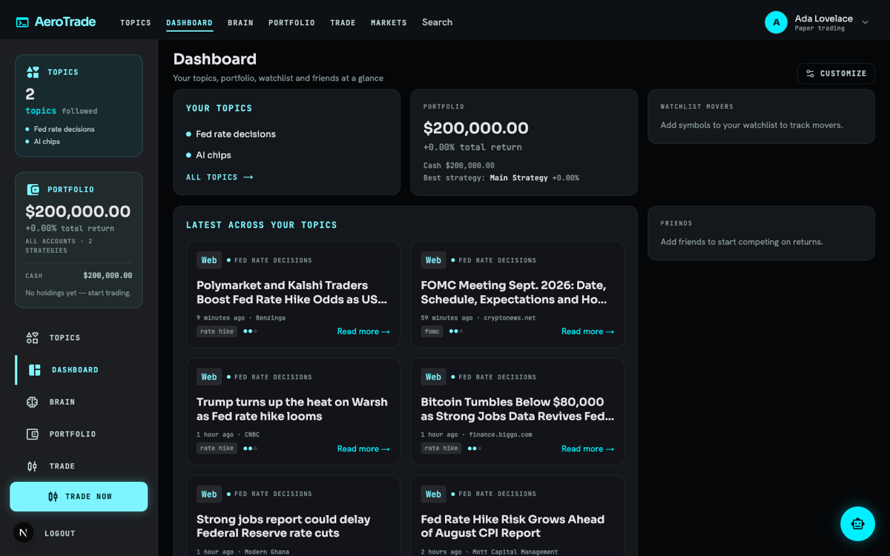
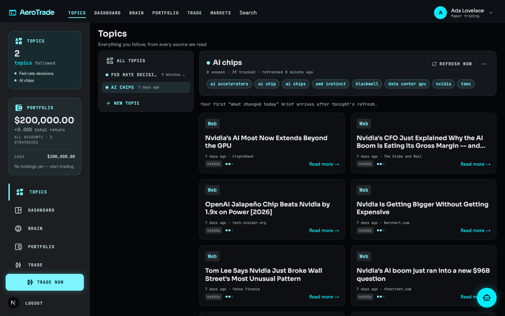
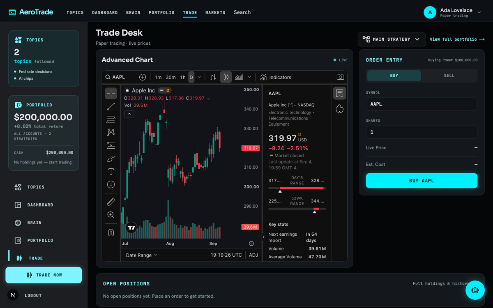
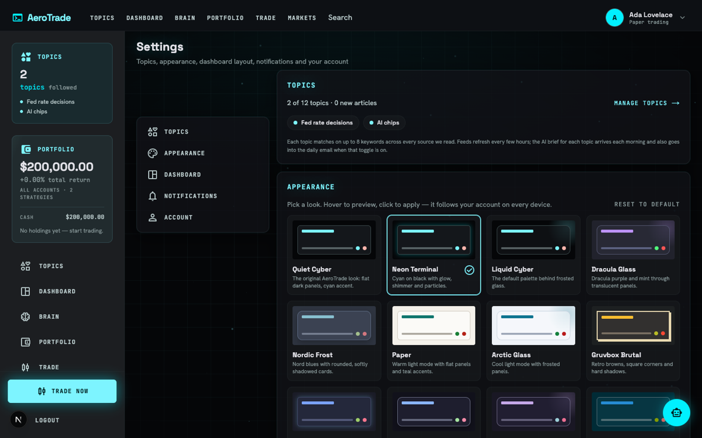
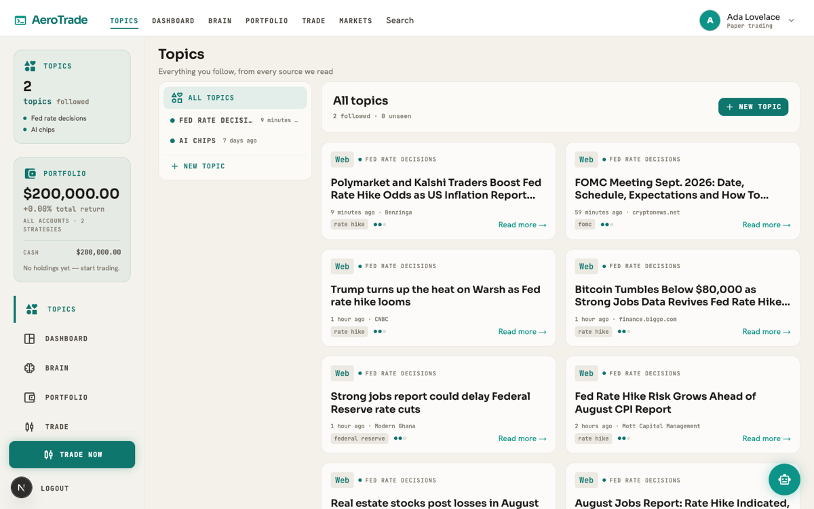
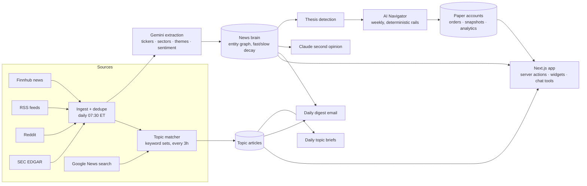

<div align="center">

# AeroTrade

**A paper-trading terminal with an AI news brain.**
Follow the topics you care about, test trading strategies with virtual money, and let scheduled AI jobs read hundreds of articles a day so you don't have to.

[](https://github.com/KingXaney/AeroTrade/actions/workflows/ci.yml)
[](LICENSE)




</div>

## What it does

**Follow the news, not just the tape.** Create a topic for anything — "Fed rate decisions", "AI chips", "NBA trade deadline" — and AeroTrade builds a feed for it from Google News search plus every source the news brain already reads. Each topic gets a daily AI *"what changed today"* brief, a slot in the daily email, and a place in the chat assistant.

**Paper-trade strategies side by side.** Open several strategy accounts with their own starting balance, place market orders at live quotes, and compare them on return, drawdown, win rate and a daily benchmark curve against SPY. Export any account's fills as CSV.

**A news brain that builds market narratives.** Every morning a job ingests finance news, RSS, Reddit and SEC filings, has Gemini extract tickers, sectors and themes with sentiment, and folds them into an entity graph with *fast* (5-day) and *slow* (60-day) attention weights. Narratives whose slow weight stays high become **theses**.

**An AI Navigator that trades on those theses — inside hard rails.** Once a week it scores an eligible universe (news mass, sentiment, momentum, thesis, sector) and rebalances a dedicated paper account. Position count, weights, cash floor, trade frequency, holding period and stop-loss are deterministic constants; the LLM only writes the rationale.

**A second opinion, a chat advisor, and a digest.** Claude can critique the brain's current picture; a tool-using chat assistant (14 tools) answers "what's new in my topics?" or "should I add NVDA?"; a daily email summarises the market for each user, personalised to their holdings, with links allow-listed to the actual articles.

**Make it yours.** 12 colour palettes × 5 visual styles (minimal, futuristic, liquid glass, brutalist, soft), saved per account and rendered without a flash. A 31-widget dashboard you can drag, resize and extend.

<div align="center">
 
<br>
 
</div>

## How it works



- **Ingestion is bounded, not greedy.** Per-source caps, a daily extraction budget (8 calls × 20 articles on Gemini's free tier), 1-second gaps between topic fetches, and a `NEWS_SEARCH_ENABLED` kill switch keep the whole thing free to run.
- **The brain never sees user topics.** Followed topics live in their own collection, keyed by keyword set so users who follow the same thing share one fetch. The navigator only ever scores the brain's global entities.
- **LLM output is treated as untrusted.** Extraction is JSON-parsed with zod and clamped; email HTML is sanitised with links allow-listed to the article set; briefs render as plain text; user keywords are escaped before they become a regex.
- **Every action is session-scoped.** Server actions derive the user from the session, validate ids, and scope every query by `userId`.

## Tech stack

| Layer | Choice |
|---|---|
| App | Next.js 16 (App Router, Server Actions, Turbopack), React 19, TypeScript strict |
| UI | Tailwind v4 with semantic theme tokens, shadcn/radix primitives, dnd-kit, TradingView embeds |
| Data | MongoDB + Mongoose 9 (16 models), better-auth for email/password sessions |
| Jobs | Inngest (6 crons + on-demand events), idempotent steps, per-user rate limits |
| AI | Vercel AI SDK; Gemini 2.5 Flash-Lite on the free tier for every scheduled job, optional Claude tiers, Claude for the second opinion |
| Market data | Finnhub (quotes, profiles, search, news), Google News RSS, SEC EDGAR, Reddit |
| Quality | Vitest (25 files / 446 tests), ESLint, `tsc --noEmit`, GitHub Actions, Playwright browser QA against an in-memory Mongo |

## Getting started

Prerequisites: Node 20+, a MongoDB connection string (Atlas free tier works), a free [Finnhub](https://finnhub.io) key and a free [Gemini](https://aistudio.google.com) key.

```bash
git clone https://github.com/KingXaney/AeroTrade.git
cd AeroTrade
npm install
cp .env.example .env        # then fill in the values — every variable is documented there
npm run dev                  # http://localhost:3000
```

Background jobs run through Inngest. For local development start its dev server next to the app and fire any job by hand:

```bash
npx inngest-cli@latest dev -u http://localhost:3000/api/inngest
npm run trigger -- brain        # build the news brain now
npm run trigger -- topics       # refresh every followed topic (briefs: the AI briefs)
npm run trigger -- navigator    # run the weekly AI Navigator
npm run trigger -- news         # send today's digest emails
```

| Job | Schedule (ET) | What it does |
|---|---|---|
| `daily-brain-update` | 07:30 daily | ingest → extract → fold into the entity graph → detect theses |
| `refresh-topic-feeds` | every 3 h | fetch + match articles for every followed keyword set |
| `generate-topic-briefs` | 08:00 daily | one "what changed today" brief per topic with fresh news |
| `ai-navigator-weekly` | Mondays 10:00 | score the universe and rebalance the Navigator account |
| `daily-news-summary` | 12:00 daily | per-user digest email with a topics section |
| `daily-account-snapshots` | weekdays 16:10 | value every account and the SPY benchmark |

## Development

```bash
npm run check         # lint + typecheck + unit tests (what CI runs)
npm test              # vitest, ~1s
npm run typecheck
npm run lint
npx next build --experimental-build-mode compile   # proves the app builds without any keys
```

Unit tests cover the pure modules — the layout engine, theme tokens, news aggregation and sanitisation, the topic matcher and query builder, brief parsing, model selection. Database-bound modules (Mongoose reads, server actions, the pages) are exercised through the browser QA recipe in [`scripts/qa/`](scripts/qa/README.md) instead: an in-memory MongoDB, the dev server with inline env vars, and a Playwright script that signs up, follows topics, and walks every surface — no keys needed. `docs/specs/` holds the design documents for the larger features.

## Project structure

```
app/            routes: (auth) sign-in/up · (root) dashboard, topics, brain, trade, portfolio, markets, watchlist, friends, history, settings · api/{chat,inngest,accounts}
components/     UI by feature: dashboard (widget grid + 31 widgets), topics, brain, trade, analytics, settings, chat, theme, ui (shadcn)
lib/
  news/         source adapters (Finnhub, RSS, Reddit, SEC, Google News search), dedupe, HTML sanitiser
  brain/        extraction prompts + parsing, entity graph update with dual-timescale decay, queries, second opinion
  navigator/    universe eligibility, composite scoring, allocation rails, order planning
  topics/       keyword normalisation, matcher, search query builder, refresh, briefs, digest section
  trading/      paper accounts, orders, portfolio maths, analytics, snapshots
  dashboard/    widget registry, layout normalisation + legacy migration, loaders
  theme/        palettes, styles, token generation
  ai/           model matrix by task and tier, chat tools, system prompt
  inngest/      the scheduled jobs
  actions/      'use server' entry points (session-derived, userId-scoped)
database/       Mongoose models and the cached connection
scripts/        trigger.mjs (fire any job locally), qa/ (browser QA), account migration, local Claude second-opinion runner
docs/specs/     design docs
```

## Origins

The auth screens, watchlist and email scaffolding began from a Next.js stock-tracker tutorial. Everything the product is about — the news brain, the AI Navigator, followed topics, paper-trading accounts, the chat tools, the theme engine and the widget dashboard — is original work, built and tested on top of that base.

## License

[MIT](LICENSE) © 2026 Xinnan Huang
